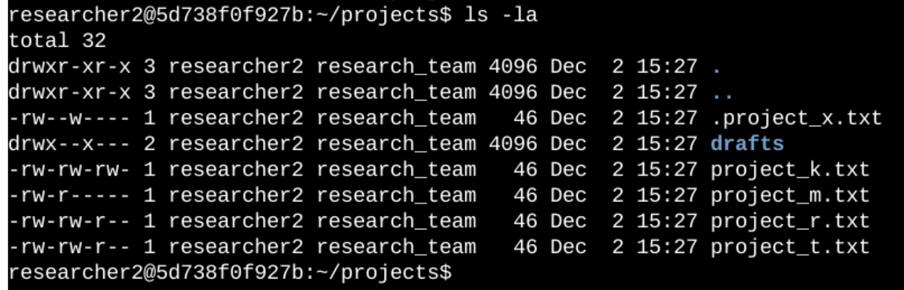
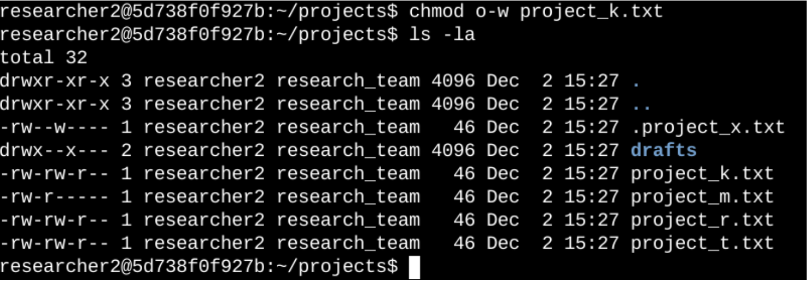
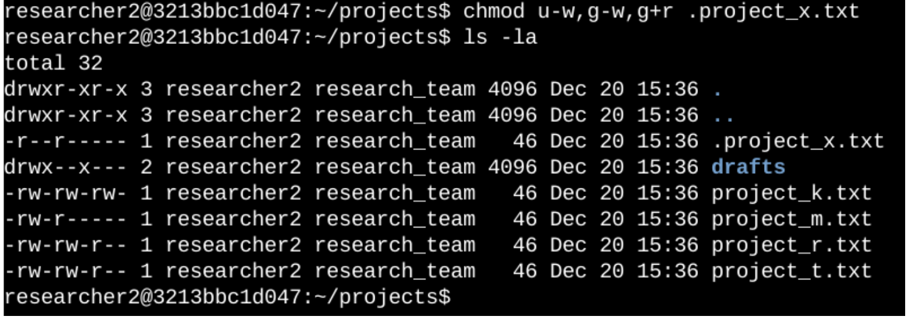
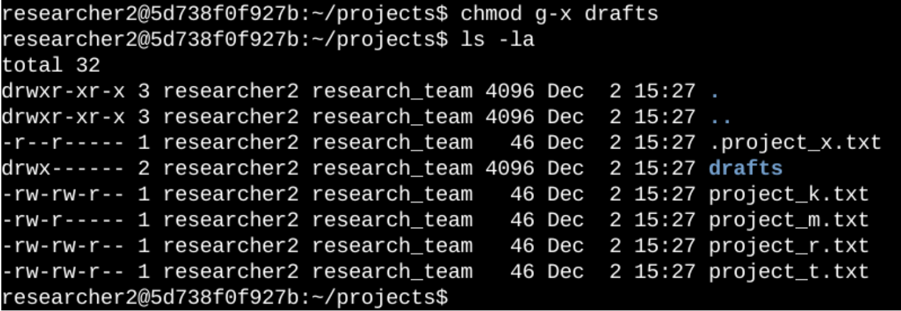

# Linux File and Directory Permissions Project

This project demonstrates managing and modifying file and directory permissions in Linux to meet security requirements. The goal was to ensure only authorized users have access to specific files and directories, using `chmod` and `ls -la` commands to inspect and adjust permissions.

## Project Overview

To maintain security, our team needed to review and adjust permissions on specific files and directories within the `projects` directory. This included restricting access, setting permissions for hidden files, and limiting directory access to specific users.

## Table of Contents
- [Project Overview](#project-overview)
- [Objectives](#objectives)
- [Linux Permissions Explanation](#linux-permissions-explanation)
- [Tasks and Screenshots](#tasks-and-screenshots)
  - [1. Viewing File and Directory Details](#1-viewing-file-and-directory-details)
  - [2. Changing File Permissions](#2-changing-file-permissions)
  - [3. Changing Hidden File Permissions](#3-changing-hidden-file-permissions)
  - [4. Changing Directory Permissions](#4-changing-directory-permissions)
- [Summary](#summary)
- [Resources](#resources)

## Objectives

1. **Inspect File Permissions**: Check permissions for files and directories.
2. **Adjust Permissions**: Modify access to files and directories based on security needs.
3. **Limit Hidden File Access**: Restrict hidden file permissions appropriately.
4. **Directory Access Control**: Ensure only specific users have access to certain directories.

## Linux Permissions Explanation

Linux permissions use a 10-character string to represent file and directory access rights:
- **1st Character**: Indicates the type (`d` for directory, `-` for file).
- **2nd-4th Characters**: User (owner) permissions.
- **5th-7th Characters**: Group permissions.
- **8th-10th Characters**: Other permissions.

For example, the permissions string `-rw-rw-r--` indicates:
- **File Type**: Regular file (`-`).
- **User Permissions**: Read and write (`rw-`).
- **Group Permissions**: Read and write (`rw-`).
- **Other Permissions**: Read-only (`r--`).

## Tasks and Screenshots

### 1. Viewing File and Directory Details
- **Command**: `ls -la`
- **Description**: Checked the permissions of all files and directories, including hidden files, within the `projects` directory.
- **Screenshot**:
  

### 2. Changing File Permissions
- **Objective**: Remove write permissions for "other" on certain files to prevent unauthorized modifications.
- **Command**: `chmod o-w project_k.txt`
- **Description**: Removed write permissions for "other" on `project_k.txt`, ensuring only user and group members can modify the file.
- **Screenshot**:
  

### 3. Changing Hidden File Permissions
- **Objective**: Restrict write access on hidden files for user and group, while allowing read-only access.
- **Command**:
  ```bash
  chmod u-w .project_x.txt    # Remove write permission for the user
  chmod g-w .project_x.txt    # Remove write permission for the group
  chmod g+r .project_x.txt    # Add read permission for the group
- **Description**: Adjusted permissions on the hidden file .project_x.txt to remove write access for user and group, allowing only read access.
- **Screenshot**:
  

### 4. Changing Directory Permissions
- **Objective**: Ensure only the researcher2 user has execute permissions on the drafts directory, preventing others from accessing the directory’s contents.
- **Command**: `chmod g-x drafts`
- **Description**: Removed execute permissions from the group on the drafts directory, restricting access to only the researcher2 user.
- **Screenshot**:
  

### Summary:
This project involved inspecting, analyzing, and modifying permissions on files and directories to align with the organization’s security policies. Using commands like `ls -la` and `chmod`, we were able to secure sensitive resources, limit unauthorized access, and establish the appropriate level of permissions.


  

